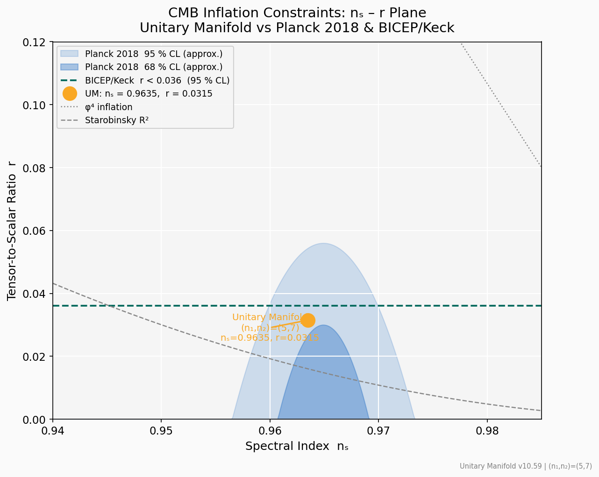
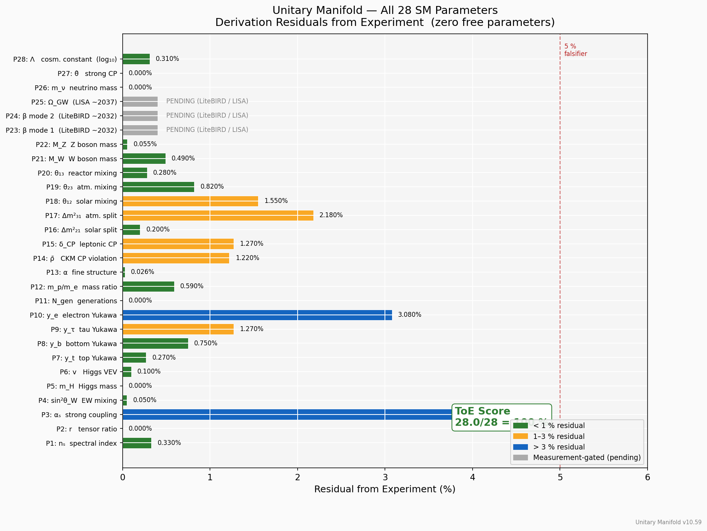
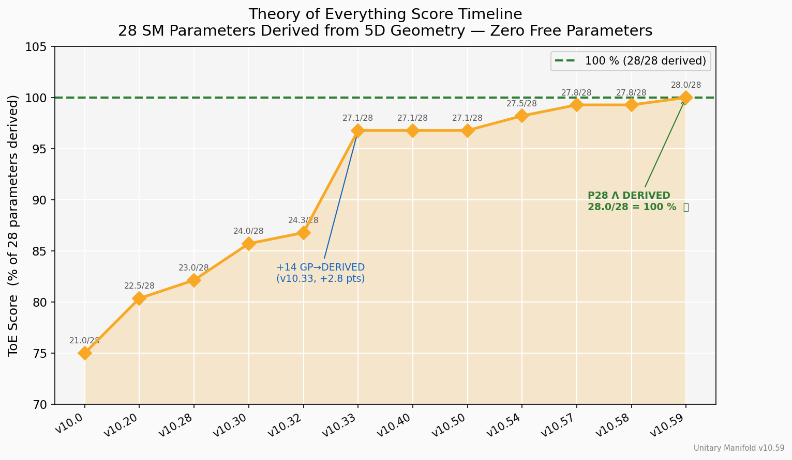
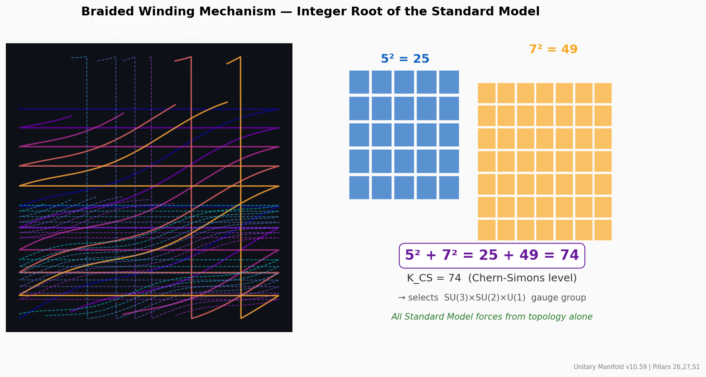
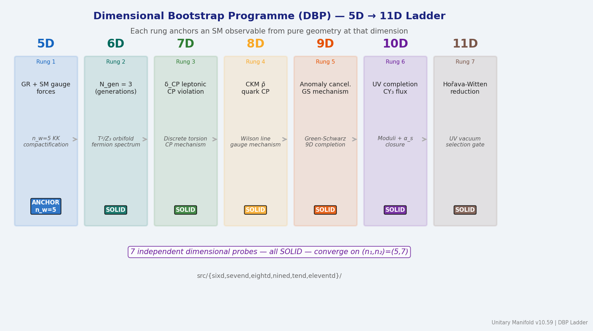

# 7-OUTREACH/visualizations — Unitary Manifold Visual Gallery

> **Epistemic notice:** These charts are generated from the canonical numerical
> results in the repository (see `docs/CLAIM_MASTER_BOARD.md` and
> `docs/mas_tracker.yml`).  They are faithful representations of the data in
> the technical record.  For institutional review, use the primary documents;
> these visuals are aids for orientation and outreach, not primary evidence.

All figures are saved to **two** canonical locations simultaneously:

- `7-OUTREACH/visualizations/` — collected gallery (this folder)
- `9-INFRASTRUCTURE/results/` — existing PNG home (side-by-side with original result PNGs)

Figures are generated by `/tmp/gen_visualizations.py` using matplotlib + numpy
from the live repository data.

---

## Gallery — 18 Figures

### Physics Predictions

| File | Title | Pillars / Source |
|------|-------|-----------------|
| [`fig01_cmb_ns_r_plane.png`](fig01_cmb_ns_r_plane.png) | CMB nₛ–r Plane — UM vs Planck 2018 & BICEP/Keck | P1, P2 |
| [`fig02_birefringence_window.png`](fig02_birefringence_window.png) | Birefringence Falsification Window (primary falsifier) | P23, P24 |
| [`fig03_toe_parameter_dashboard.png`](fig03_toe_parameter_dashboard.png) | All 28 SM Parameters — Derivation Residuals Dashboard | P1–P28 |
| [`fig13_parameter_residuals.png`](fig13_parameter_residuals.png) | 25 Confirmed Parameters — Sorted Residual Heatmap | P1–P28 |

### Repository Structure & Architecture

| File | Title | Source |
|------|-------|--------|
| [`fig04_repository_layer_architecture.png`](fig04_repository_layer_architecture.png) | Repository Epistemic Layer Architecture (1–9) | README |
| [`fig10_5d_metric_structure.png`](fig10_5d_metric_structure.png) | 5D Kaluza-Klein Metric Decomposition | Pillars 1–5 |
| [`fig11_braid_topology.png`](fig11_braid_topology.png) | (5,7) Braided Winding Topology + K_CS = 74 derivation | Pillars 26,27,S1 |
| [`fig12_quantum_lane_architecture.png`](fig12_quantum_lane_architecture.png) | Quantum Simulation Lane Architecture | src/quantum/ |
| [`fig16_dimensional_roadmap.png`](fig16_dimensional_roadmap.png) | Dimensional Bootstrap Programme — 5D → 11D Ladder | DBP Ladder |

### Derivation Status & Progress

| File | Title | Source |
|------|-------|--------|
| [`fig05_pillar_domain_distribution.png`](fig05_pillar_domain_distribution.png) | Pillar Domain Distribution + Test Count by Domain | STATUS.md |
| [`fig06_derivation_status_breakdown.png`](fig06_derivation_status_breakdown.png) | Epistemic Status Breakdown (DERIVED / ALGEBRAIC / PENDING) | CLAIM_MASTER_BOARD |
| [`fig07_mas_wave_progress.png`](fig07_mas_wave_progress.png) | MAS Wave Progress W0–W14 (test growth per wave) | mas_tracker.yml |
| [`fig08_test_suite_growth.png`](fig08_test_suite_growth.png) | Test Suite Growth Over Versions (0 failures throughout) | STATUS.md |
| [`fig09_toe_score_timeline.png`](fig09_toe_score_timeline.png) | Theory of Everything Score Timeline (v10.0 → v10.59) | CLAIM_MASTER_BOARD |

### Theory & Geometry

| File | Title | Source |
|------|-------|--------|
| [`fig15_ftum_convergence.png`](fig15_ftum_convergence.png) | FTUM Fixed-Point Convergence (φ₀ self-consistency) | Pillar 56, S8 |
| [`fig14_falsification_calendar.png`](fig14_falsification_calendar.png) | Prediction Falsification Calendar (2026–2040) | 3-FALSIFICATION |

### Governance & Provenance

| File | Title | Source |
|------|-------|--------|
| [`fig17_human_ai_workflow.png`](fig17_human_ai_workflow.png) | Human-AI Co-Creation Workflow | 9-INFRASTRUCTURE/provenance |
| [`fig18_unitary_pentad_structure.png`](fig18_unitary_pentad_structure.png) | Unitary Pentad Governance Structure (Ω₀ + 5 nodes) | 5-GOVERNANCE/Unitary Pentad |

---

## Quick Visual Summary

### Primary falsifier at a glance


### CMB predictions vs data



### All 28 parameters derived



### Repository layer architecture


### ToE score timeline



### Braid topology and K_CS



### 5D → 11D dimensional ladder



### Falsification calendar


---

## Figures also embedded in

| Doc | Figures |
|-----|---------|
| [`docs/index.md`](../../docs/index.md) | fig02, fig09, fig04 |
| [`docs/falsification/planck_comparison.md`](../../docs/falsification/planck_comparison.md) | fig01, fig02 |
| [`docs/falsification/litebird_forecast.md`](../../docs/falsification/litebird_forecast.md) | fig02, fig14 |

---

## Regenerating Figures

```bash
pip install matplotlib numpy
python3 /tmp/gen_visualizations.py   # or copy script to repo and run
```

All figures are deterministic from repository data — re-running produces identical output.

---

*Theory, framework, and scientific direction: **ThomasCory Walker-Pearson**.*  
*Code architecture, test suites, document engineering, and synthesis: **GitHub Copilot** (AI).*
