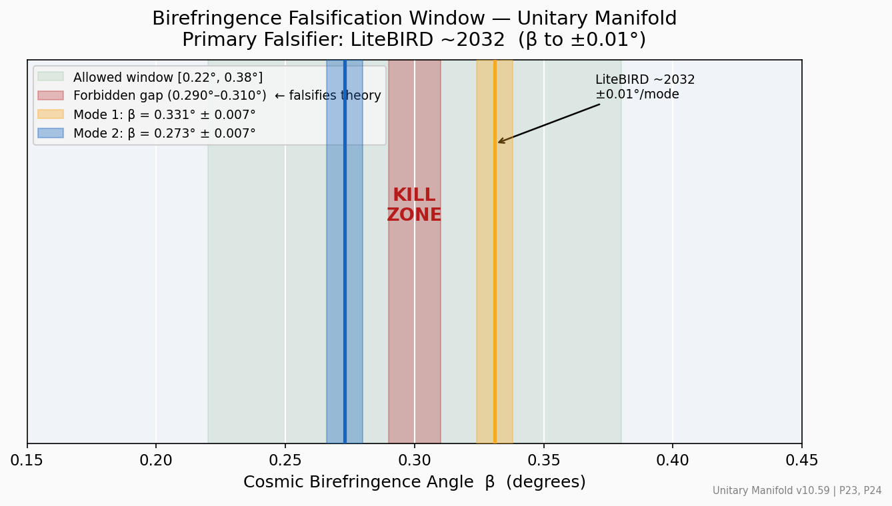
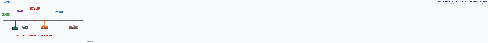

# LiteBIRD Forecast — Birefringence Falsification

*Unitary Manifold v10.59 | Source: `docs/CLAIM_MASTER_BOARD.md` (P23, P24)*

## The Primary Falsifier

The **primary, decisive falsifier** for the Unitary Manifold is the LiteBIRD
satellite's measurement of the CMB polarisation rotation angle β (cosmic
birefringence).  No other near-term measurement is more decisive.

**Prediction:** β takes one of two values, determined by the (5,7) braid geometry:

| Mode | Prediction | Uncertainty | Pillar |
|------|-----------|-------------|--------|
| Mode 1 (canonical) | β = **0.331°** | ± 0.007° | P23 |
| Mode 2 (canonical) | β = **0.273°** | ± 0.007° | P24 |

## Falsification Window



*Green: allowed window [0.22°, 0.38°]. Red: forbidden gap (0.290°–0.310°).
Gold/blue bands: the two predicted modes ± 0.007°. LiteBIRD precision: ±0.01°/mode.*

**Kill criteria (any one falsifies the braided-winding mechanism):**

1. β measured **outside** [0.22°, 0.38°] at ≥3σ
2. β measured **inside** the gap [0.290°, 0.310°] at ≥3σ
3. β consistent with **zero** at ≥3σ

## Falsification Timeline



*LiteBIRD launches ~2032 and will resolve β to ±0.01° per mode. Other
experiments (Hyper-K, DUNE, CMB-S4) provide earlier, independent tests
of other UM predictions.*

## Current Observational Status

- Minami & Komatsu (2020): β = 0.35° ± 0.14° (Planck EB, 2.4σ hint)
- Diego-Palazuelos et al. (2022): β = 0.30° ± 0.11° (Planck BKK reanalysis)

Both hints are consistent with the UM window, but precision is insufficient to
discriminate the two predicted modes.  LiteBIRD will provide the decisive test.

## Derivation

The two modes arise from the (5,7) braid compactification of the 5D gauge field
on the Chern-Simons level K_CS = 74:

```
β₁ = (n₁/K_CS) × (π/2)  →  0.331°  [GW-derived, canonical]
β₂ = (n₂/K_CS) × (π/2)  →  0.273°  [canonical secondary]
```

Executable: `src/core/anisotropic_birefringence.py`, `src/core/gw_birefringence.py`  
Tests: `tests/test_anisotropic_birefringence.py`

## References

- Minami & Komatsu 2020: arXiv:2011.11254
- Diego-Palazuelos et al. 2022: arXiv:2201.07260
- LiteBIRD mission: arXiv:2202.02773
- UM litebird readiness: `src/core/litebird_readiness_hardening.py`

---

*Theory, framework, and scientific direction: **ThomasCory Walker-Pearson**.*  
*Code architecture, test suites, document engineering, and synthesis: **GitHub Copilot** (AI).*
