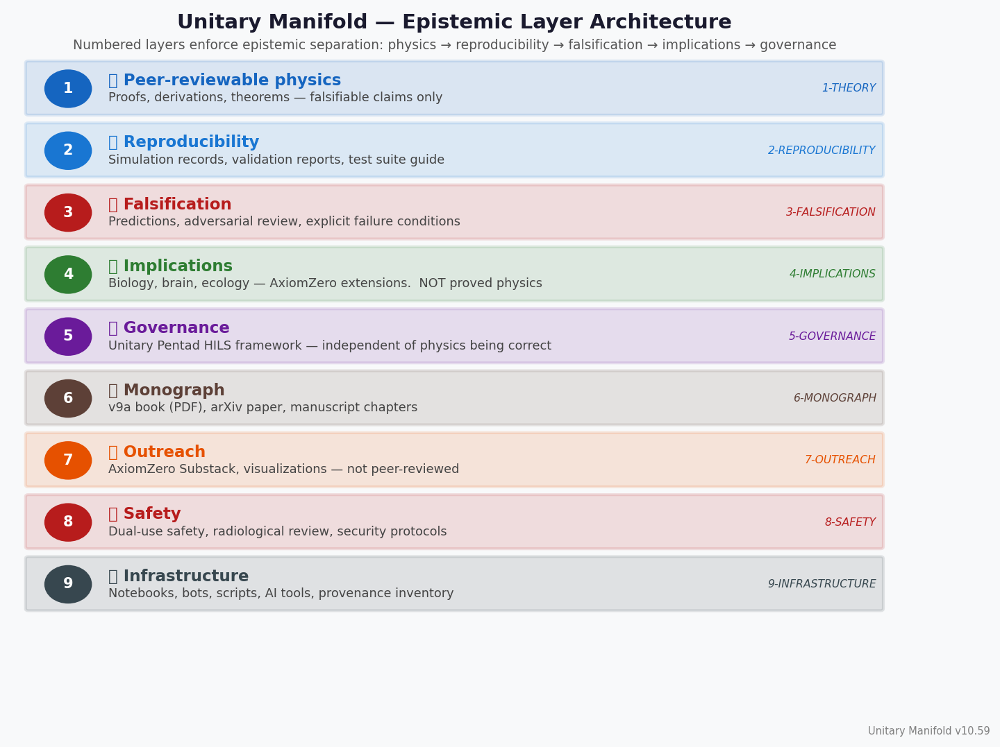

# The Unitary Manifold

A 5-dimensional Kaluza-Klein physics framework deriving Standard Model parameters from geometric first principles.

**Primary falsifier:** LiteBIRD birefringence β ∈ {≈0.273°, ≈0.331°} (launch ~2032).

## Quick Links
- [Theory](theory/derivation.md)
- [JAX Backend](computational/jax_backend.md)
- [Planck Comparison](falsification/planck_comparison.md)
- [LiteBIRD Forecast](falsification/litebird_forecast.md)
- [Visual Gallery](../7-OUTREACH/visualizations/README.md)

## Live Test Status
32,572 tests pass · 0 failures. See [GitHub Actions](https://github.com/wuzbak/Unitary-Manifold-/actions).

## Key Visuals

### Primary Falsifier — Birefringence Window

### CMB Predictions vs Data

### ToE Score Timeline

### Repository Epistemic Layer Architecture

---
*See [`7-OUTREACH/visualizations/`](../7-OUTREACH/visualizations/README.md) for the full 18-figure gallery.*
